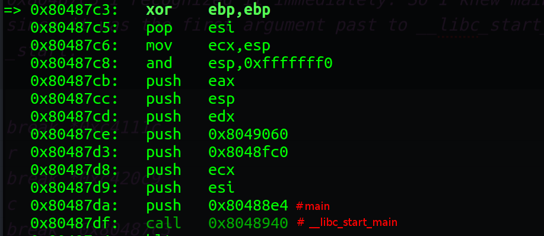
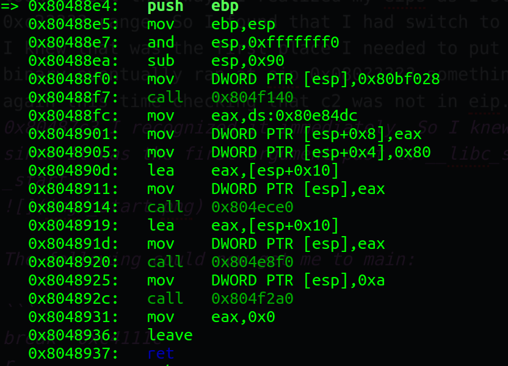

# Complex problem (Mixed 400 pts)

We were given [this](img.zip) file.

If you unzip the file you will get the following bmp image.


Hoping I wouldn't have to play with the image file I ran strings on the image and noticed a bunch of base64. However, I realized in the output from strings it was not one contiguous block of base64 there were multiple blocks separated by a new line character. So in IPython I skipped the bitmap header and grabbed the base64.

```
import base64
f = open('img.bmp', 'rb')
d = f.read()
v = d[0x7a:] #skip the header
u = ''.join([base64.b64decode(x) for x in v.split('\n')])
open('img.out', 'wb').write(u)
```
The file command showed it was a 32-bit ELF binary. Running strings gave me a whole lot of garbage but from xxd I saw it was UPX packed.


So I ran strings again to see if I could get any comments.

```
> strings -n 15 img3.output
..
$Info: This file is packed with the UPX executable packer http://upx.sf.net $
$Id: UPX 3.93 Copyright (C) 1996-2017 the UPX Team. All Rights Reserved. $
..
```
I downloaded the exact packer and tried to unpack the binary. Unfortunately, it did not work. So I thought I would have to manually unpack the binary but I should probably go ahead and run the binary to see what it did (probably should have had already done this). The binary printed out
```
> ./img.out
I'm Exhausted

```  
Then it gave us a prompt which was then printed out. Interestingly enough there was a format string vulnerability. So I used that to print out the stack to see if anything was there. When there was not anything there I decided to try using gdb-peda since I didn't have a network address I needed to connect to to solve the problem I new I could find the flag in the binary without using the format string. At this point you can jump to the answer section because it could have easily been completed at this point but I of course thought I needed to unpack the binary, it's a 400 point question after all.

### Unnecessary Stuff
I wasn't sure how to find the OEP in an ELF binary as I have always used Ollydbg with PE files to figure out the OEP and grab the original binary from memory. I knew radare could do it but I thought that as long as I could get to main in a controlled manner I wouldn't actually need to unpack the binary because I could reverse main. I noticed that the original code entry point started at 0xc40e90 from 'readelf -h'. I decided to check what eip was after the "I'm Exhausted" message was printed.

```
> gdb -q img.out
gdb-peda $ r
gdb-peda $ ctrl-c
gdb-peda $ bt
gdb-peda $ break *0x0806d712
gdb-peda $ c
```

After that I stepi'd and tried to figure out what was going on to see if I could find main. I was having a hard time determining where main was this way so I had the idea to start the program in peda and then use the peda api to step until the upper byte of eip changed. I thought since the entry point was 0xc40e90 if I checked to see if c4 was not in eip as I stepped I might find the OEP and then eventually main, I bet angr could probably do this faster in hind sight.

```
gdb-peda $ python while "c4" in peda.execute_redirect('x/xw $eip')[2:4]: print(peda.execute_redirect('stepi'))

```

I ran the command for about 3 minutes or so, it could have been faster if I didn't want to print out the context sections in peda but it looked cool that way. I realized my eips as I stepped were in the 0xc2???? range. So I found that I had switch to that eip at 0xc420c9 so I knew that was the first place I needed to put a breakpoint. I knew my binary eventually ran at eip 0x080????? something so I ran the script again this time checking that c2 was not in eip. I found _start next at 0x80487c3 I recognized it immediately. So I knew main was at 0x80488e4 since it was the first argument past to __libc_start_main within _start.  


The following could now get me to main:

```
break *0xc4111c
r
break *0xc420c9
c
break *0x80487c3
c
break *0x80488e4
c
```


I debugged the different functions in main saw that one printed out the "I'm Exhausted" message one that took our input and then another that printed our input. Didn't seem to complicated. At this point I decided to go to the end of main and see if there were any strings in memory. I want to see if the flag would be there.

```
gdb-peda $ strings heap 5
0x80e806b: Ifkfkfk
0x80e8073: RklUe201bjRiYWRpYXNjdn0=
0x80ebd48: /home/shawn/fitctf2017/imagefile
0x80ebfe8: linux-gate.so.1
```
Looks like base64 at 0x80e806b

```
> echo -n RklUe201bjRiYWRpYXNjdn0= | base64 -d
FIT{m5n4badiascv}
```
So I kicked myself for not running strings on memory segments in the first place.

### Answer
Run strings on memory
```
> cat extract.py
import base64
f = open('img.bmp', 'rb')
d = f.read()
v = d[0x7a:] #skip the header
u = ''.join([base64.b64decode(x) for x in v.split('\n')])
open('img.out', 'wb').write(u)

> python extract.py
> gdb -q img.out
gdb-peda $ r
gdb-peda $ ctrl-c
gdb-peda $ strings heap 5
0x80e806b: Ifkfkfk
0x80e8073: RklUe201bjRiYWRpYXNjdn0=
0x80ebd48: /home/shawn/fitctf2017/imagefile
0x80ebfe8: linux-gate.so.1
> echo -n RklUe201bjRiYWRpYXNjdn0= | base64 -d
FIT{m5n4badiascv}
```
